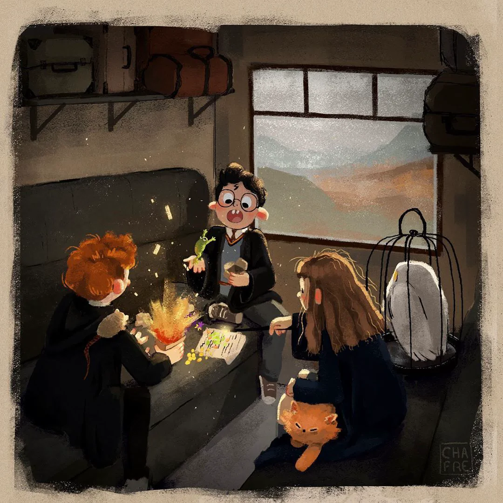

<div align="center">

# ⚡ Spell Library ⚡

### ✨ Where Every Click Feels Like Magic ✨



<br/>


> *"Happiness can be found even in the darkest of times, if one only remembers to turn on the light."* ✨  
> — **Albus Dumbledore**

<br>


<br>
</div>

---

# 📜 Welcome to Spell Library

> Enter the magical world of Hogwarts, where every page feels like a spellbook waiting to be opened.

**Spell Library** is a Harry Potter-inspired interactive website built using **HTML, CSS, and JavaScript**. It recreates the magic of Hogwarts through immersive visuals, smooth animations, an admission portal, magical books, and an interactive spell-casting game.

---

# ✨ Features

| 🪄 | Magical Experience |
|:---:|-------------------|
| 🏰 | Hogwarts Inspired Landing Page |
| 📜 | Interactive Admission Portal |
| 📚 | Magical Spell Books |
| 🎮 | Spell Casting Game |
| 🎵 | Immersive Background Music |
| ✨ | Smooth Animations |
| 📱 | Fully Responsive Design |
| ⚡ | Organized Folder Structure |

---

# 🏰 Project Structure

```text
Spell-Library/
│
├── Admission/
├── Books/
├── Game/
├── assets/
├── fonts/
│
├── index.html
├── style.css
├── script.js
└── .hintrc
```

---

# 🪄 Tech Stack

<div align="center">

| HTML5 | CSS3 | JavaScript |
|:-----:|:----:|:----------:|
| 🌐 | 🎨 | ⚡ |

</div>

---

# 🚀 Getting Started

### Clone the Repository

```bash
git clone https://github.com/khushanuma-shabbir/Spell-Library.git
```

### Open the Project

```bash
cd Spell-Library
```

### Launch

Simply open **index.html** in your favorite browser and begin your magical journey.

---

# 🧙 Explore the Magic

✨ Hogwarts Landing Page

📜 Admission Portal

📚 Spell Library

🎮 Spell Casting Game

---

<div align="left">

## 👩‍💻 Author

### Khushanuma Shabbir Mansuri  
B.Tech Information Technology 

🔗 GitHub: https://github.com/khushanuma-shabbir  
🔗 Link: https://spell-library.vercel.app/

---

## ⭐ Support This Project

If you like this project, please give it a ⭐ on GitHub.

### ⚡ Mischief Managed ⚡  
*"After all this time?"* **Always.**

</div>
